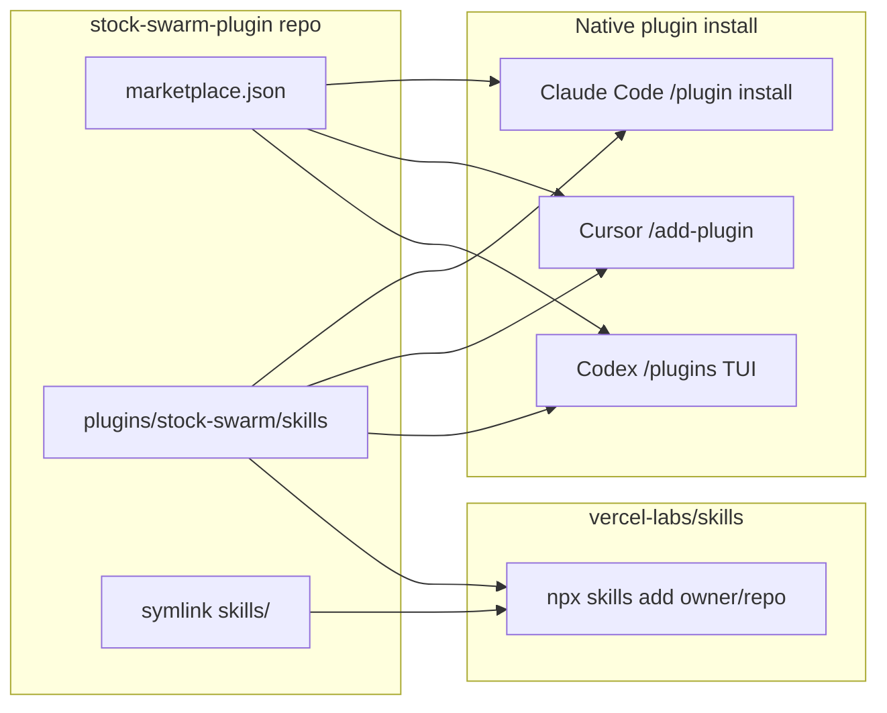

# feat: Repackage TradingAgents skills as stock-swarm-plugin

## Overview

Transform this repository from a fork of the TauricResearch TradingAgents Python framework into **stock-swarm-plugin** — a standalone, installable agent-skills plugin modeled after [compound-engineering-plugin](https://github.com/EveryInc/compound-engineering-plugin), optimized for low maintenance.

**Keep:** 24 trading skills under `plugins/stock-swarm/skills/`, shared references, MCP examples, documentation.

**Remove:** All Python runtime (`tradingagents/`, `cli/`, `tests/`, `pyproject.toml`, Docker, `uv.lock`, upstream assets).

**Install strategy (hybrid, no custom bun converter):**

1. **Native plugin manifests** — Claude Code, Cursor, Codex (one-time JSON, ~25 lines each; platforms auto-discover skills from `skills/`).
2. **vercel-labs/skills CLI** — `npx skills add <owner>/stock-swarm-plugin` for 50+ other agents (OpenCode, Pi, Gemini, Kiro, Droid, Qwen, Windsurf, etc.) with zero repo maintenance.

This matches the user's "CE coverage if feasible in one-time setup w/o maintenance" goal without shipping CE's TypeScript converter.

---

## Problem Frame

The current repo is a hybrid: upstream LangGraph Python app plus locally authored Agent Skills. Users who only want the skills must clone a large Python project, manually copy `skills/` into `.cursor/skills/`, and maintain duplicate trees (`skills/` vs `.cursor/skills/`). There is no marketplace entry, no versioned releases, and no single install path.

The user wants a **new repository** (`stock-swarm-plugin`) that is skills-only, discoverable like compound-engineering, and easy to install/update — without owning a cross-platform converter.

---

## Requirements Trace

- R1. New repo contains only skills, plugin manifests, docs, and minimal tooling — no Python app.
- R2. Install works on Cursor, Claude Code, and Codex via native plugin marketplace flows (CE parity for primary targets).
- R3. Install/update works on other agents via `npx skills add` without a custom maintainer-owned converter.
- R4. Single canonical `skills/` tree — no duplicate `.cursor/skills/` copy in the repo.
- R5. README documents full trading-swarm workflow, credentials (EODHD, Robinhood MCP), and disclaimers.
- R6. Optional MCP config shipped as examples only (no secrets).
- R7. MIT license; fresh CHANGELOG from v0.1.0; attribution to TauricResearch / honeypot / maia-skill preserved in README.
- R8. User can cut over from this working tree to a clean `git init` on GitHub as `stock-swarm-plugin`.

---

## Scope Boundaries

- Building custom subagents (CE ships 51 agents; stock-swarm is skill-orchestration only — the host agent plays personas).
- Shipping or maintaining a bun/TypeScript converter (`@every-env/compound-plugin` fork).
- Bundling the maia-skill Next.js dashboard.
- Automated backtesting, LangGraph, or CLI for running analysis.
- Publishing to npm (only document `npx skills add` consuming the GitHub repo).
- skills.sh registry listing (optional follow-up; not required for v1 install).

### Deferred to Follow-Up Work

- GitHub Actions release automation (tag → GitHub Release) — add when publishing is routine.
- `skills.sh` listing for discoverability.
- Optional thin wrapper commands (e.g. `/stock-swarm`) if a platform supports plugin commands without much maintenance.
- Sanitized `examples/` analyses from current `analyses/` folder.

---

## Context & Research

### Relevant Code and Patterns

| Asset | Location today | Action |
|-------|----------------|--------|
| Canonical skills (24) | `skills/` | Move to `plugins/stock-swarm/skills/` |
| Duplicate skills | `.cursor/skills/` | Delete from repo; users install via plugin or `npx skills` |
| Skills catalog | `skills/README.md` | Merge into plugin README + shorten |
| MCP example | `.cursor/mcp.example.json` | Move to `plugins/stock-swarm/mcp.example.json` |
| Live MCP (local only) | `.cursor/mcp.json` | **Do not commit** — add to `.gitignore` |
| Session outputs | `analyses/`, `.cursor/skills/...` dated dirs | Exclude from plugin repo |
| Root README | Upstream Python focus | Replace with plugin README |
| `.env.example` | API keys for EODHD, Robinhood | Keep at repo root (user project config) |

### CE plugin structure (reference)

```
.claude-plugin/marketplace.json          # repo root — marketplace catalog
plugins/compound-engineering/
  .claude-plugin/plugin.json
  .cursor-plugin/plugin.json
  .codex-plugin/plugin.json              # includes "skills": "./skills/"
  skills/                                # all SKILL.md trees
  AGENTS.md, README.md, CHANGELOG.md, LICENSE
```

### vercel-labs/skills (reference)

- `npx skills add owner/repo` discovers skills under `skills/` (and platform-specific paths).
- Supports `--skill`, `-a cursor`, `-g`, `skills update`, symlink vs copy.
- **Repo layout implication:** CE uses `plugins/stock-swarm/skills/`; vercel CLI expects `skills/` at paths it scans. **Resolution:** document install as:

  ```bash
  npx skills add owner/stock-swarm-plugin --skill '*' -a cursor -y
  # with path: plugins/stock-swarm/skills/<name> OR symlink skills/ → plugins/stock-swarm/skills at repo root
  ```

  **Recommended:** add a root-level `skills/` symlink or re-export:

  ```
  skills/  →  plugins/stock-swarm/skills   (symlink committed, or duplicate — symlink preferred)
  ```

  so both CE marketplace (`source: ./plugins/stock-swarm`) and `npx skills add` work without two trees.

### Institutional Learnings

- None in `docs/solutions/` for this repo.

### External References

- [compound-engineering-plugin](https://github.com/EveryInc/compound-engineering-plugin) — marketplace + per-platform manifests
- [vercel-labs/skills](https://github.com/vercel-labs/skills) — cross-agent install/update CLI
- [agentskills.io](https://agentskills.io/home) — SKILL.md format

---

## Key Technical Decisions

| Decision | Rationale |
|----------|-----------|
| **Marketplace layout** (`plugins/stock-swarm/`) | Matches CE; allows future second plugin in same repo; `marketplace.json` points at `./plugins/stock-swarm`. |
| **Root `skills/` → symlink to plugin skills** | One canonical tree; satisfies vercel-labs/skills path expectations without duplication. |
| **Native manifests only (Claude/Cursor/Codex)** | ~75 lines JSON total; no TS maintenance; covers primary agents + CE-style marketplace install. |
| **No bun converter** | User asked for vercel-labs/skills approach; CE converter is high ongoing cost for skill-only plugin. |
| **Skills-only, no bundled agents** | Trading personas are prompts in SKILL.md; host model role-plays — unlike CE code-review agents. |
| **New git history** | User wants new repository; implement as orphan branch or fresh `git init` after file layout is ready. |
| **MIT license** | Plugin ecosystem norm (CE uses MIT); replace upstream Apache-2.0 NOTICE with attribution section in README. |
| **MCP as example only** | `mcp.example.json` + docs; users copy to `.cursor/mcp.json` locally — no credentials in repo. |

---

## Open Questions

### Resolved During Planning

- **Layout:** Marketplace with `plugins/stock-swarm/` (CE pattern), not single-plugin-at-root.
- **Installer:** vercel-labs/skills for long tail; native manifests for Claude/Cursor/Codex — not CE bun converter.
- **Name:** `stock-swarm-plugin` (repo + plugin id `stock-swarm`).
- **Platforms v1:** Native three + `npx skills` for all others (satisfies "match CE if one-time, no maintenance").

### Deferred to Implementation

- Exact GitHub org/username for marketplace URLs in `plugin.json`.
- Whether to commit symlink `skills/` (works on macOS/Linux; Windows clone may need `npx skills add` path flag — document in README).
- Pin `npx skills` minimum version in README if a specific flag is required for monorepo skill paths.

---

## Output Structure

```
stock-swarm-plugin/
├── .claude-plugin/
│   └── marketplace.json
├── plugins/
│   └── stock-swarm/
│       ├── .claude-plugin/plugin.json
│       ├── .cursor-plugin/plugin.json
│       ├── .codex-plugin/plugin.json
│       ├── skills/                    # 24 skill directories (moved from current skills/)
│       │   ├── trading-swarm/
│       │   ├── analyst-technical/
│       │   └── ...
│       ├── mcp.example.json
│       ├── AGENTS.md                  # optional: skill inventory for agents
│       ├── CHANGELOG.md
│       └── LICENSE
├── skills -> plugins/stock-swarm/skills   # symlink for npx skills CLI
├── .env.example
├── .gitignore
├── README.md                          # install + workflow + disclaimer
├── SECURITY.md                        # brief: no trade execution, local creds only
└── docs/
    └── plans/                         # this plan
```

---

## High-Level Technical Design

> *Directional guidance for review, not implementation specification.*



**User update path:** Re-run marketplace plugin update (platform-specific) or `npx skills update` — no custom release tooling required for v1.

---

## Implementation Units

- U1. **Scaffold marketplace repo layout**

**Goal:** Create empty plugin directory structure and root config files without moving skills yet.

**Requirements:** R1, R8

**Dependencies:** None

**Files:**
- Create: `.claude-plugin/marketplace.json`
- Create: `plugins/stock-swarm/.claude-plugin/plugin.json`
- Create: `plugins/stock-swarm/.cursor-plugin/plugin.json`
- Create: `plugins/stock-swarm/.codex-plugin/plugin.json`
- Create: `plugins/stock-swarm/LICENSE`, `plugins/stock-swarm/CHANGELOG.md`
- Create: `.gitignore`, `SECURITY.md`
- Modify: `.env.example` (trim to skills-relevant keys only)

**Approach:**
- Copy field shapes from CE `plugin.json` files; set `name`/`version`/`description` for stock-swarm; Codex manifest includes `"skills": "./skills/"`.
- `marketplace.json` lists one plugin with `"source": "./plugins/stock-swarm"`.
- `.gitignore`: Python artifacts, `.venv`, `.env`, `.cursor/mcp.json`, `analyses/`, `__pycache__`, `.DS_Store`.

**Patterns to follow:**
- `EveryInc/compound-engineering-plugin/.claude-plugin/marketplace.json`
- `plugins/compound-engineering/.cursor-plugin/plugin.json`

**Test scenarios:**
- Happy path: `marketplace.json` parses as valid JSON and references existing `./plugins/stock-swarm` path.
- Edge case: All three `plugin.json` files share consistent `name`, `version`, `repository` URL placeholder.
- Error path: Codex `plugin.json` includes `skills` path that resolves relative to plugin root.

**Verification:**
- JSON validates; directory tree matches Output Structure (minus skills content).

---

- U2. **Migrate skills and deduplicate**

**Goal:** Move canonical skills into plugin; remove duplicates and session artifacts.

**Requirements:** R1, R4

**Dependencies:** U1

**Files:**
- Create: `plugins/stock-swarm/skills/**` (move from `skills/**`)
- Create: `skills` symlink → `plugins/stock-swarm/skills`
- Delete: top-level `skills/` (after move), `.cursor/skills/`, `analyses/`
- Modify: internal cross-links in SKILL.md if any use absolute paths (should stay relative)

**Approach:**
- `git mv skills/* plugins/stock-swarm/skills/` (or rsync then delete).
- Verify all 24 skill folders present; `trading-swarm/references/` intact.
- Remove `.cursor/skills` entirely from repo.

**Test scenarios:**
- Happy path: Each skill has `SKILL.md` with `name` and `description` frontmatter.
- Edge case: `eodhd/references/` and `portfolio-analyzer/references/` paths still resolve from SKILL.md links.
- Integration: `trading-swarm` references `verification-protocol.md`, `voice-and-tone.md` without broken relative paths.

**Verification:**
- Count 24 skill directories; `grep -r` for broken `skills/` paths in SKILL.md returns none.

---

- U3. **Ship MCP example and env template**

**Goal:** Document optional data integrations without committing secrets.

**Requirements:** R6

**Dependencies:** U2

**Files:**
- Create: `plugins/stock-swarm/mcp.example.json` (from `.cursor/mcp.example.json`)
- Modify: `.env.example` — `EODHD_API_KEY`, `ROBINHOOD_*` only; comment pointers to setup docs
- Modify: `plugins/stock-swarm/skills/portfolio-analyzer/references/robinhood-mcp-setup.md` — install path references plugin layout

**Approach:**
- Strip any real keys from example files.
- README section: copy `mcp.example.json` → user project's `.cursor/mcp.json`.

**Test scenarios:**
- Happy path: `mcp.example.json` is valid JSON with `envFile: .env` pattern.
- Error path: No file in repo contains live API keys (grep for key patterns).

**Verification:**
- Example MCP parses; `.env.example` documents all keys referenced by skills.

---

- U4. **Write plugin README and AGENTS.md**

**Goal:** Replace upstream Python README with install-first plugin documentation.

**Requirements:** R5, R7

**Dependencies:** U2, U3

**Files:**
- Create: `README.md` (repo root)
- Create: `plugins/stock-swarm/AGENTS.md` (skill inventory + when-to-use table from `skills/README.md`)
- Delete: upstream `README.md` content, `CHANGELOG.md` (root), Python badges/assets

**Approach:**
- Sections: Philosophy (multi-agent trading research), Quick start (`/add-plugin` / Claude marketplace / `npx skills add`), Skill catalog table, Workflows (trading-swarm, portfolio, market-opportunity-scan), Credentials, MCP setup, Disclaimer, Attribution (TauricResearch, honeypot, maia-skill).
- Preserve voice/disclaimer language from `trading-swarm/references/disclaimer.md`.

**Patterns to follow:**
- CE README install sections (abbreviated)
- Current `skills/README.md` catalog

**Test scenarios:**
- Happy path: README includes install commands for Cursor, Claude Code, Codex, and `npx skills add`.
- Edge case: Disclaimer states not financial/tax advice.

**Verification:**
- New developer can install and run `trading-swarm` on a ticker following README only.

---

- U5. **Remove Python application and upstream cruft**

**Goal:** Delete all non-plugin code and assets.

**Requirements:** R1, R8

**Dependencies:** U2 (skills safely migrated)

**Files:**
- Delete: `tradingagents/`, `cli/`, `tests/`, `scripts/`, `build/`, `assets/`, `main.py`, `test.py`, `pyproject.toml`, `requirements.txt`, `uv.lock`, `Dockerfile`, `docker-compose.yml`, `tradingagents.egg-info/`, root `CHANGELOG.md`, `.dockerignore`, `.env.enterprise.example`, `.claude/` (if only TSC cache), `.venv/`

**Approach:**
- Single commit "chore: remove upstream Python framework".
- Keep `LICENSE` decision: MIT at `plugins/stock-swarm/LICENSE` + root `LICENSE` pointing to same or single root MIT.

**Test scenarios:**
- Happy path: `find . -name '*.py' -not -path './.git/*'` returns empty (or only intentional scripts if U6 adds validate).
- Edge case: No large binary assets remain except optional favicon later.

**Verification:**
- Repo size drops dramatically; no importable Python package remains.

---

- U6. **Validate skill frontmatter and cut over git remote**

**Goal:** Ensure skills meet agentskills.io conventions; initialize clean repo for GitHub publish.

**Requirements:** R2, R3, R8

**Dependencies:** U4, U5

**Files:**
- Create: `scripts/validate-skills.mjs` (optional, ~50 lines) OR document manual checklist in `CONTRIBUTING.md`
- Create: `CONTRIBUTING.md` (minimal: skill frontmatter rules, no drive-by Python)

**Approach:**
- Script checks: each `plugins/stock-swarm/skills/*/SKILL.md` has YAML frontmatter with `name` and `description`; `name` matches directory.
- Fresh repo: `git checkout --orphan main` or new directory copy → `git init` → first commit `feat: initial stock-swarm-plugin v0.1.0`.
- Tag `v0.1.0`; create GitHub repo `stock-swarm-plugin`; push.
- Manual smoke tests (document in plan verification, execute during ce-work):
  - Cursor: `/add-plugin` or marketplace add
  - `npx skills add . --list` shows 24 skills
  - Claude: `/plugin marketplace add <owner>/stock-swarm-plugin` + install

**Execution note:** Run smoke tests on at least one native platform before announcing v0.1.0.

**Test scenarios:**
- Happy path: validate script exits 0 on all 24 skills.
- Edge case: Skill with missing `description` fails validation with actionable error.
- Integration: `npx skills add <local-path> --list` discovers all skills via root symlink.

**Verification:**
- v0.1.0 tag on GitHub; install smoke test passes on Cursor or Claude Code.

---

## System-Wide Impact

- **Interaction graph:** No runtime code — only static skills consumed by host agents. `trading-swarm` orchestration assumes host can read other skills in the same plugin install.
- **Error propagation:** N/A at repo level; skill docs define verification and disclaimer behavior.
- **State lifecycle risks:** Users may commit `analyses/` output locally — `.gitignore` should recommend `analyses/` for consumer projects, not plugin repo.
- **API surface parity:** Install docs must stay in sync across three native paths + `npx skills` — single README table reduces drift.
- **Integration coverage:** MCP + EODHD + Robinhood are optional; skills degrade to web-search when keys missing (already documented in individual skills).
- **Unchanged invariants:** SKILL.md content and trading workflow semantics preserved from current `skills/` — only packaging changes.

---

## Risks & Dependencies

| Risk | Mitigation |
|------|------------|
| `npx skills` does not resolve `plugins/stock-swarm/skills` without root symlink | Commit `skills/` → `plugins/stock-swarm/skills` symlink; document direct path install as fallback |
| Windows clones break symlinks | README: use `npx skills add` with `--copy` or WSL; optional `skills/` directory duplicate if reports demand it |
| Codex needs agents for parallel personas | Document that host model plays roles sequentially (by design); no CE-style agent pack |
| Upstream license (Apache-2.0) vs MIT for derived skills | README attribution; skills are original prompts — MIT for plugin packaging |
| Cursor plugin marketplace submission requirements unknown | Ship manifests matching CE; manual `/add-plugin` from GitHub works without store approval |
| Duplicate install (plugin + `npx skills` same project) | README: choose one method per project |

---

## Documentation / Operational Notes

- Root README is the single install source of truth.
- `plugins/stock-swarm/CHANGELOG.md` starts at `0.1.0` — note migration from TradingAgents fork.
- Consumer projects: copy `.env.example` → `.env`; optional MCP; run analyses to local `analyses/` (user project, not plugin).
- No server, no CI required for v1 — add Actions when release cadence justifies it.

---

## Sources & References

- Origin: user request (repackage as CE-style plugin, skills-only, new repo, name `stock-swarm-plugin`)
- Related code: `skills/`, `skills/README.md`, `.cursor/mcp.example.json`
- [compound-engineering-plugin](https://github.com/EveryInc/compound-engineering-plugin)
- [vercel-labs/skills](https://github.com/vercel-labs/skills)
- [agentskills.io](https://agentskills.io/home)
