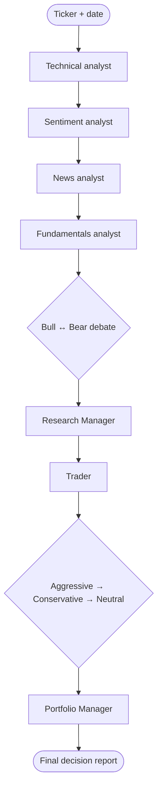

# Trading swarm workflow

Loosely mirrors the TradingAgents LangGraph pipeline without running Python.



## Phase 1 — Analyst team (sequential)

Run each skill in order, passing **all prior reports** as context:

1. `analyst-technical`
2. `analyst-sentiment`
3. `analyst-news`
4. `analyst-fundamentals`

Skip analysts the user excludes (minimum: technical + fundamentals OR news).

## Phase 2 — Investment debate

Default **2 rounds** = 4 turns (Bull → Bear → Bull → Bear).

| Round | Skill |
|-------|-------|
| 1 | `researcher-bull` |
| 2 | `researcher-bear` |
| 3 | `researcher-bull` |
| 4 | `researcher-bear` |

Append each turn to a running `## Debate transcript` section.

Then run `research-manager` on the full transcript + four analyst reports.

## Phase 3 — Trader

Run `trader` with: all analyst reports + investment plan.

## Phase 4 — Risk debate

Default **2 rounds** = 6 turns cycling:

Aggressive → Conservative → Neutral → (repeat)

| Turn order | Skill |
|------------|-------|
| 1 | `risk-aggressive` |
| 2 | `risk-conservative` |
| 3 | `risk-neutral` |
| ... | repeat until round budget exhausted |

Then run `portfolio-manager` with: analyst reports, investment plan, trader proposal, risk transcript, optional past lessons from user.

## Working document

Maintain one markdown artifact (e.g. `analysis-{TICKER}-{DATE}.md`) with sections:

```markdown
# {TICKER} — Trading swarm analysis ({DATE})

## Analyst reports
### Technical
...
### Sentiment
...
### News
...
### Fundamentals
...

## Investment debate
...

## Investment plan
...

## Transaction proposal
...

## Risk debate
...

## Final trading decision
...
```

Update after each phase. Deliver the completed file to the user.

## Disclaimer

Research and education only — not financial, investment, or trading advice.
